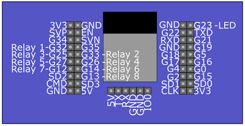

# ESP32 Sprinkler Control

A WiFi-enabled smart sprinkler controller for the ESP32 microcontroller, featuring:

- **Manual zone control**
- **Quick Run** (run all enabled zones for a set time, with live countdown)
- **Web-based interface** (works on desktop and mobile)
- **Live status updates** and visual highlights for active Quick Run
- **Easy configuration and scheduling**

---

## Features

### Quick Run Mode
- Start all enabled zones for a user-defined duration (per zone)
- Live countdown timer for the current zone
- Visual highlight (red border/text) when Quick Run is active
- Stop Quick Run at any time

### Manual Control
- Turn individual zones ON/OFF from the web UI

### Scheduling
- (Optional) Set up automatic schedules for watering

### Web Interface
- Responsive, easy-to-use UI
- Real-time status updates via AJAX polling

---

## Getting Started

### Hardware
- ESP32 development board
- Relay board for sprinkler valves
- Power supply for relays/valves

### Software
- Arduino IDE 2.3.4 or PlatformIO
- ESP32 board support package

### Setup
1. Clone this repository:
   ```sh
   git clone https://github.com/crblair/esp32-Sprinkler-Control.git
   ```
2. Open the project in Arduino IDE or PlatformIO.
3. Configure your WiFi credentials and zone settings in the code.
4. Build and upload to your ESP32.
5. Connect to the ESP32's web interface for setup and control.

---

## Wiring Diagrams

Below are the wiring diagrams for the ESP32 Sprinkler Controller hardware setup:

### 1. ESP32 Relay 8X with UART Wiring - Diagram 1


### 2. ESP32 Relay 8X with UART Wiring - Diagram 2


### 3. ESP32 Relay 8X with UART Wiring - Program Jumper


### 4. ESP32 Relay 8X Header Pinout (PNG)


---

## Screenshots

 <!-- Add screenshot if available -->

---

## Project Structure

- `esp32_sprinkler_control/` — Main source code
- `webserver.cpp` — Web server and UI logic
- `schedule.h/cpp` — Scheduling and Quick Run logic
- `program_page.cpp` — (Optional) Program/schedule configuration page
- `config.cpp` — Configuration routines

---

## Contributing
Pull requests and suggestions are welcome! Please open an issue to discuss major changes first.

---

## License
This project is licensed under the MIT License.

---

## Credits
- Developed by crblair with AI pair-programming assistance.
- Based on ESP32 Arduino libraries and open-source web technologies.
