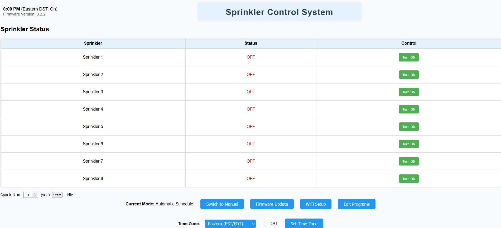

<<<<<<< HEAD
# ESP32 Sprinkler Control (v3.2.3)

A WiFi-enabled smart sprinkler controller for the ESP32 microcontroller, featuring:

- **Manual zone control**
- **Quick Run** (run all enabled zones for a set time, with live countdown)
- **Web-based interface** (works on desktop and mobile)
- **Live status updates** and visual highlights for active Quick Run
- **Easy configuration and scheduling**
- **Multiple program schedules**
- **Persistent configuration storage**
- **Support for custom watering schedules by weekday and time**

---

## Features

### Quick Run Mode
- Start all enabled zones for a user-defined duration (per zone)
- Live countdown timer for the current zone
- Visual highlight (red border/text) when Quick Run is active
- Stop Quick Run at any time

### Manual Control
- Turn individual zones ON/OFF from the web UI

### Scheduling
- (Optional) Set up automatic schedules for watering

### Run Program Now
- Instantly run any program once, without disrupting normal schedules
- Does not interfere with manual or Quick Run modes

### Web Interface
- Responsive, easy-to-use UI
- Real-time status updates via AJAX polling

---

## Automatic Schedule Recalculation
- Whenever you save a program in the web UI, the controller immediately recalculates today's schedule and updates all relays. No reboot or waiting for midnight required.

---

## File Overview
- `esp32_sprinkler_control.ino`: Main Arduino sketch, entry point for the application
- `config.*`: Configuration management (load/save settings)
- `network.*`: WiFi and network setup
- `network_state.*`: Tracks network connection state
- `program_page.*`: Handles program scheduling logic
- `quick_run.cpp`: Quick/manual run mode implementation
- `schedule.*`: Scheduling logic for watering times
- `sprinkler_controller.*`: Interface to the physical sprinkler hardware
- `sprinkler_system_state.h`: State tracking for the sprinkler system
- `timeprefs.*`: Time preferences and related settings
- `webserver.*`: Embedded web server for UI and configuration
- `weekday.*`: Helper for weekday calculations

---

## Changelog

### v3.2.3
- Added "Run Program Now" feature: Instantly run a selected program once, without affecting normal schedules.
- Improved schedule reliability: Schedules are recalculated immediately after saving a program in the UI.
- Main loop logic improved for seamless interaction between Run Program Now, Quick Run, and scheduled/manual modes.
- Various reliability and usability improvements.

---

## Getting Started

### Hardware
- ESP32 development board
- Relay board for sprinkler valves
- Power supply for relays/valves

### Software
- Arduino IDE (2.3.4 or later) or PlatformIO
- ESP32 board support package
- Required libraries: WiFi, WebServer, EEPROM, and other standard Arduino libraries

### Setup
1. Clone this repository:
   ```sh
   git clone https://github.com/crblair/esp32-Sprinkler-Control.git
   ```
2. Open the project in Arduino IDE or PlatformIO.
3. Configure your WiFi credentials and zone settings in the code.
4. Build and upload to your ESP32.
5. Connect to the ESP32's web interface for setup and control.

---

## Wiring Diagrams

Below are the wiring diagrams for the ESP32 Sprinkler Controller hardware setup:

### 1. ESP32 Relay 8X with UART Wiring - Diagram 1


### 2. ESP32 Relay 8X with UART Wiring - Diagram 2


### 3. ESP32 Relay 8X with UART Wiring - Program Jumper


### 4. ESP32 Relay 8X Header Pinout (PNG)


---

## Main Web Interface



### Button & Area Descriptions

| Area/Button         | Description                                                            |
|--------------------|------------------------------------------------------------------------|
| Quick Run          | Start a timed run for all enabled zones. Enter duration and click Start.|
| Start/Stop Button  | Starts or stops the Quick Run session.                                 |
| Manual Zone Buttons| Turn each sprinkler zone ON or OFF individually.                       |
| Status Area        | Shows which zone is running, total zones, and live countdown timer.    |
| Highlight/Red Box  | Indicates Quick Run is active (red border and countdown text).         |

---

## Screenshots

 <!-- Add screenshot if available -->

---

## Project Structure

- `esp32_sprinkler_control/` — Main source code
- `webserver.cpp` — Web server and UI logic
- `schedule.h/cpp` — Scheduling and Quick Run logic
- `program_page.cpp` — (Optional) Program/schedule configuration page
- `config.cpp` — Configuration routines

---

## Usage

- Connect to the ESP32 via its web interface (find the IP address via serial monitor or your router)
- Configure watering schedules, zones, and preferences via the web UI
- Manual quick run is available for immediate watering

---

## Contributing

Pull requests and suggestions are welcome! Please open an issue to discuss major changes first and ensure code is well-documented and tested.

---

## License

This project is open source under the MIT License. See LICENSE file for details (add a LICENSE file if needed).

---

## Credits

- Developed by crblair with AI pair-programming assistance.
- Based on ESP32 Arduino libraries and open-source web technologies.
=======
# esp32-Sprinkler-Control
Full featured esp32 Relay 8x Sprinkler Control with manual, 3 programs, quick run features.  WiFi credential entry, OTA firmware upgrade
>>>>>>> bdea8958988b94b839f5292951406914c942b897
